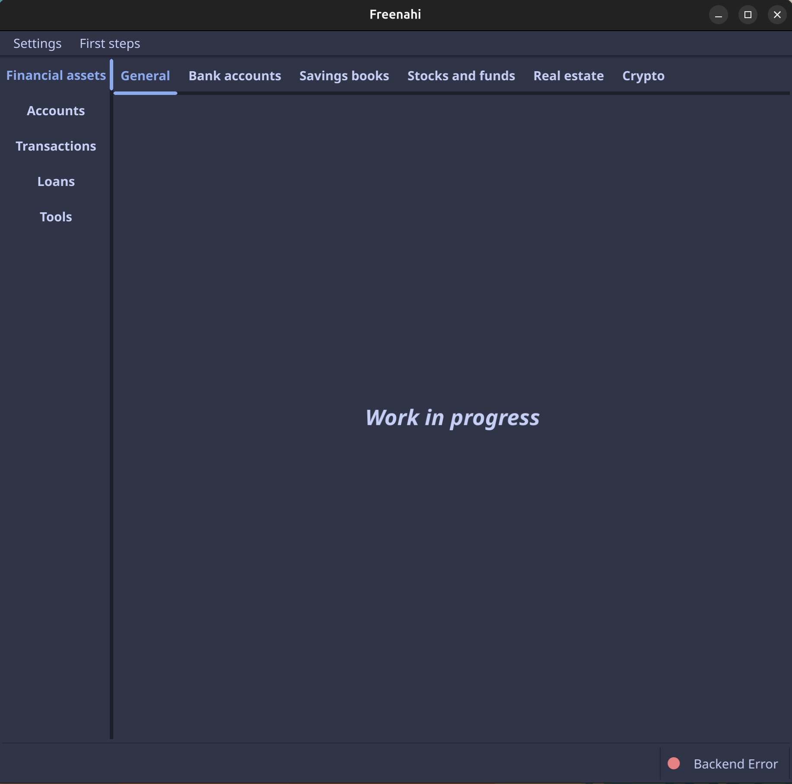

# Application

## Installation
To install Freenahi (the application, ie the frontend), just download the [latest release](https://github.com/soragXYZ/freenahi/releases){:target="_blank"} from the releases page to your computer.  

The app ships as a single executable file that can be run directly. When you run the app for the first time it will automatically configure itself for the current user (i.e. by creating folders in the home folder for the current user).

You can find the latest packages for download for your environment on the [releases page](https://github.com/soragXYZ/freenahi/releases){:target="_blank"}.  

For now, the application only ships for Linux distributions.

### Linux
???+ Note

    The app is shipped in the AppImage format, so it can be used without requiring installation and run on many different Linux distributions.

* Download the latest AppImage file from the releases page and make it executable.  
To make it executable, enter the command: chmod +x *downloadedFile*
* Execute it to start the app.

???+ Tip

    If you get the following error: {==AppImages require FUSE to run.==}, you need to first install FUSE on your system.  
    This is a library required by all AppImages to function. Please see [this page](https://docs.appimage.org/user-guide/troubleshooting/fuse.html#the-appimage-tells-me-it-needs-fuse-to-run){:target="_blank"} for details.


### Windows
This is a work in a progress

### From source
It is also possible to build and run the app directly from the source on the github repository.  
For that to work, your system needs to be setup for building Fyne apps, which requires you to have installed :

* the Go tools
* a C compiler
* system graphics driver

For more details, please see [Fyne - Getting started](https://docs.fyne.io/started/){:target="_blank"}.

When you have all necessary tools installed, you can build and run this app directly from the repository with:

```shell
go run github.com/soragXYZ/freenahi@latest
```

### Unsupported platforms
Mobile phone and MacOS are not supported at the moment and will probably never be

## First launch

When you have downloaded the correct executable for your environment, you can now start it for the first time.  

On the first launch, a new window should show up, similar to this one:

{ width="600" }

If you have this screen, congratulations, you successfully launched the application.

In the next page, we will see how to configure the backend so we can connect our bank accounts and get our first data.


???+ info
    Note that in the bottom right corner the application indicates that there is an error with the backend.  
    This is the intended behaviour since the backend is not configured yet.