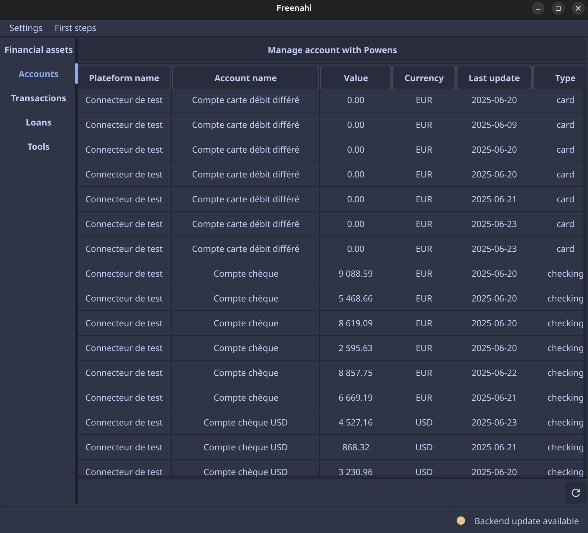

# First data

So now you should have a Powens account, a running backend server and you should be able to start the application.  

To verify that the application can successfully contact the backend, you can launch it and check the status of the server in the bottom right corner of the application.

{ width="600" }

The server status should be green (everything is fine), or orange (an update is available).

## Connect a test account

To receive your first data, you can go to the **Account** tabs and click on the **Manage Powens accounts** button.  

Your browser should open. From here, you can add your accounts (real data) or use a demo account to retrieve fake data.  

To retrieve fake data, you can use the connector **Connecteur de test** and use fake data.
