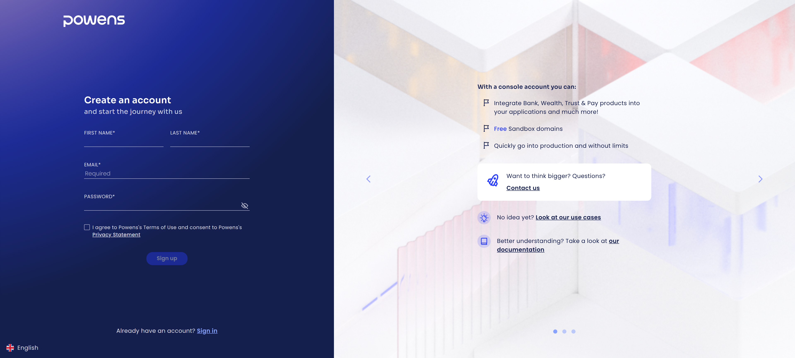
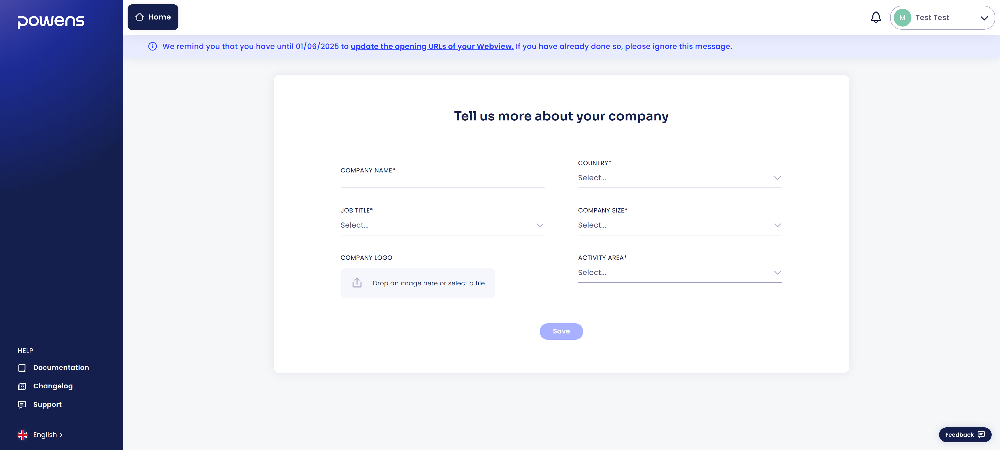
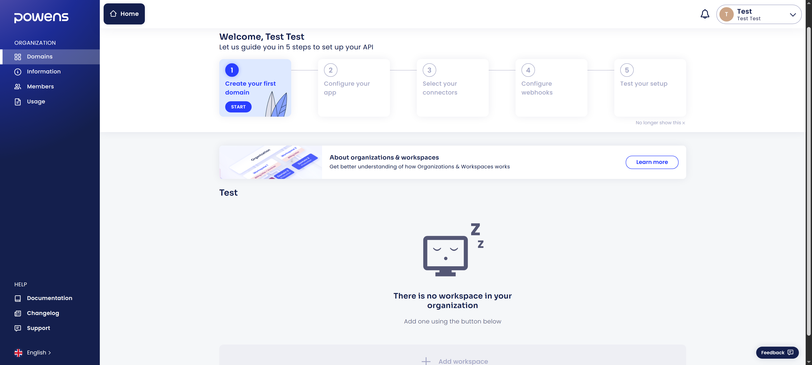
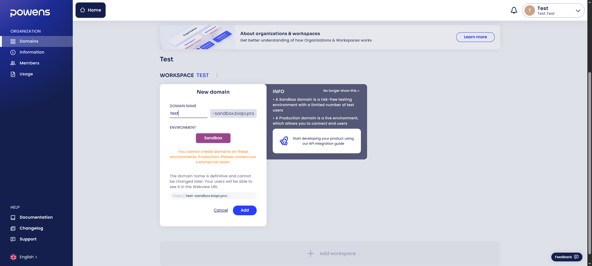
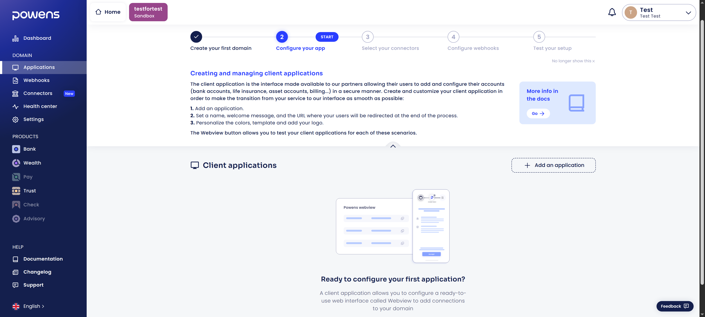
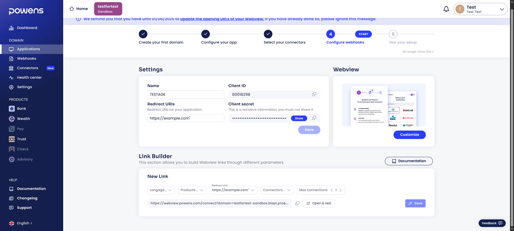
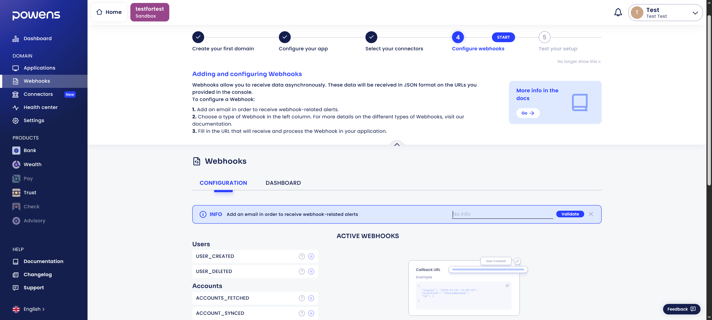
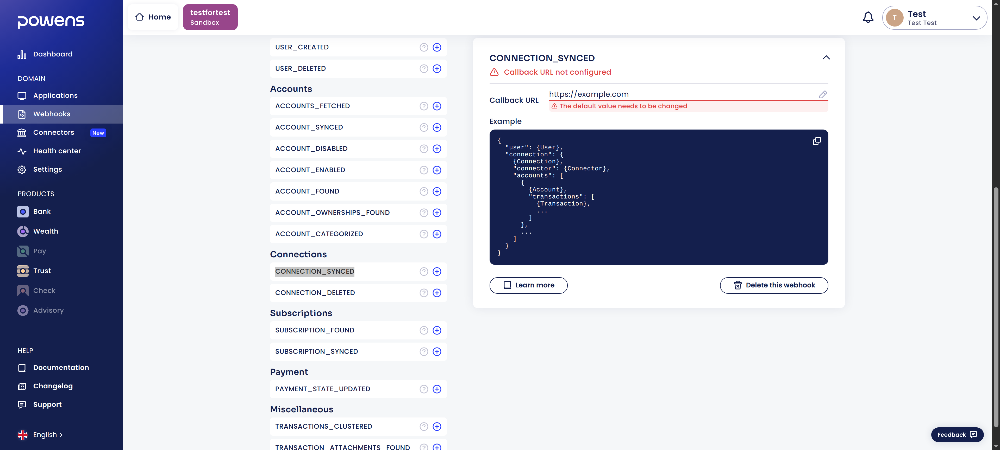
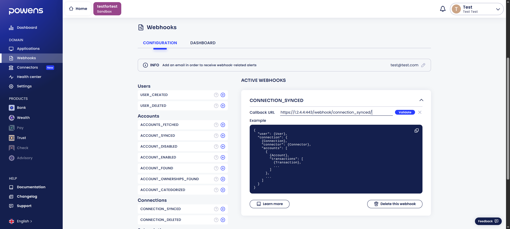
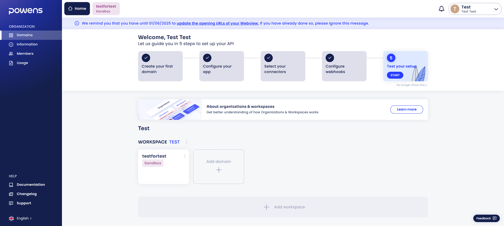

# Powens

La première chose à faire pour utiliser Freenahi est de se créer un compte Powens pour pouvoir récupérer les réponses de leur API.  
Powens est l'utilitaire qui va permettre d'aggréger vos données bancaires.

???+ info
    Si vous voulez avoir plus d'informations sur Powens et son fonctionnement, vous pouvez consulter [cette page](../whatIs/powens.md).

    Si besoin, vous pouvez aussi suivre la [documentation de Powens](https://docs.powens.com/documentation/integration-guides/quick-start){:target="_blank"} pour créer votre compte.

## Créer un compte
Rendez-vous sur [cette page](https://console.powens.com/auth/register){:target="_blank"} et créer votre compte

Vous pouvez vérifier votre boîte mail, confirmer votre adresse mail puis vous connecter. Vous aurez désormais accès à la console de Powens.

## Détails de l'entreprise
Une fois connecté, vous aurez quelques informations à fournir pour pouvoir créer votre "entreprise".
Les informations à fournir sont:

* Le nom de l'entreprise
* Sa taille
* Son pays d'activite
* Son domaine d'activité

Le nom de votre entreprise sera utilisé pour créer votre organisation et votre premier espace de travail.

???+ tip
    Vous pouvez remplir ces champs avec des données aléatoires

## Créer un espace de travail et enregistrer son domaine
A partir de là, il faut créer un espace de travail. Vous pouvez choisir le nom que vous voulez, cela n'a pas réellement d'importance.

Quand votre organisation et votre premier espace de travail auront été créés, vous pouvez cliquer sur le bouton de création et choisir un nom de domaine.
Le domaine sera créé dans une configuration "bac à sable", et sera automatiquement suffixé par -sandbox.biapi.pro.  

Gardez votre nom de domaine noté quelque part car vous en aurez besoin plus tard pour la configuration du backend.

## Créer une application client
La prochaine chose à faire est de créer une application client.
Sa définition permet de configurer la webview associée, qui est la fenêtre qui s'affichera lorsque vous devrez rentrer vos identifiants bancaires.

Vous devez rentrer le nom de votre application client, mais vous pouvez laisser les autres champs tel quel.
Votre application devrait maintenant apparaître dans la liste.

## Enregistrer un webhook
Powens met à disposition des webhooks. L'utilisation de webhook est l'approche recommandée pour être notifié quand des nouvelles données sont disponibles. Vous pouvez vous abonner à un webhook dans la console et Powens enverra automatiquement les données associées à l'évènement qui s'est produit.

La première chose à faire est d'enregistrer un email pour recevoir les alertes liées au webhooks dans le cas ou quelque chose ne se passerait pas comme prévu.

Après ca, nous pouvons créer notre premier webhook.
Actuellement, 1 seul webhook est nécessaire, **connection_synced**.  
Cliquez sur le bouton + et ajoutez-le.

Il faut ensuite configurer l'URL de callback.
L'URL de callback est l'endpoint qui sera appelé par Powens pour envoyer les données qu'il a aggrégé à partir de vos comptes bancaires.  
Pour le configurer, il faut entrer votre adresse IP publique (si vous voulez héberger Freenahi chez vous) or le nom de votre domaine privé. Votre adresse publique vous est donnée par votre fournisseur d'accès Internet (FAI).

???+ info
    Si vous hébergez Freenahi chez vous, vous avez besoin d'une adresse IP fixe.  
    Vérifiez avec votre FAI si c'est bien le cas.

    Vous pouvez obtenir votre adresse IP publique [à cette adresse](https://www.showmyip.com/){:target="_blank"}. Désactivez votre VPN si vous en utilisez un.

Ensuite, vous devez compléter votre IP avec le port que vous souhaitez utiliser (80 ou 443 en général) et le endpoint du backend qui gère ce webhook: **/webhook/connection_synced/**

Par exemple, si votre adresse publique est **1.2.3.4** et que vous voulez utiliser le port **443** (port par défaut pour l'HTTPS), alors vous devez entrer **https://1.2.3.4:443/webhook/connection_synced/**

## Connecteurs
Les connecteurs représentent des institutions avec lesquelles Powens peut établir une connexion pour récupérer des données.  
Par exemple, vous avez un connecteur avec BoursoBank, American Express...
Par défaut, seulement 33 connecteurs sont activés (sur un total de 1941 !)

Par simplicité, vous pouvez activer tous les connecteurs dans l'onglet connecteur.

## Obtenir les identifiants de son application
La dernière étape est d'obtenir les identifiants et les variables d'environnement nécessaires pour notre backend.
Pour le moment, 3 sont nécessaires:

* Le "Client ID" et "Client secret", disponibles dans l'onglet application client
* Le nom de domaine que vous avez choisi précedemment, disponible dans l'onglet domaine

Ici le nom de domaine est **testfortest**

